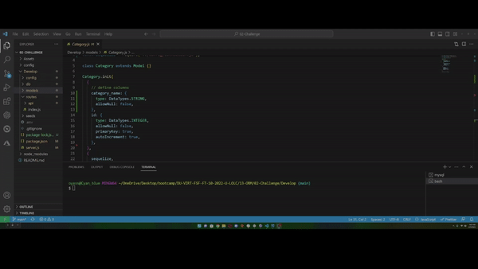

# ORM: E-Commerce Back End

# App Features

Get all Tags/Products/Categories
Get a Tag/Product/Category by ID
Create a new Tag/Product/Category
Update Tag/Product/Category name
Delete a Tag/Product/Category by ID

### Install Dependencies

Run the following commands to start using the application most efficiently

```
npm i          -  install depedencies
npm run seed   -  seed all data
npm run watch  -  run nodemon
```
### Watch the video below for the Demo ⤵

[](https://drive.google.com/file/d/1aTp7E4MtAPGSpVkReqA_n72lyR5QMYRa/view?usp=sharing "ORM eCommerce Backend")